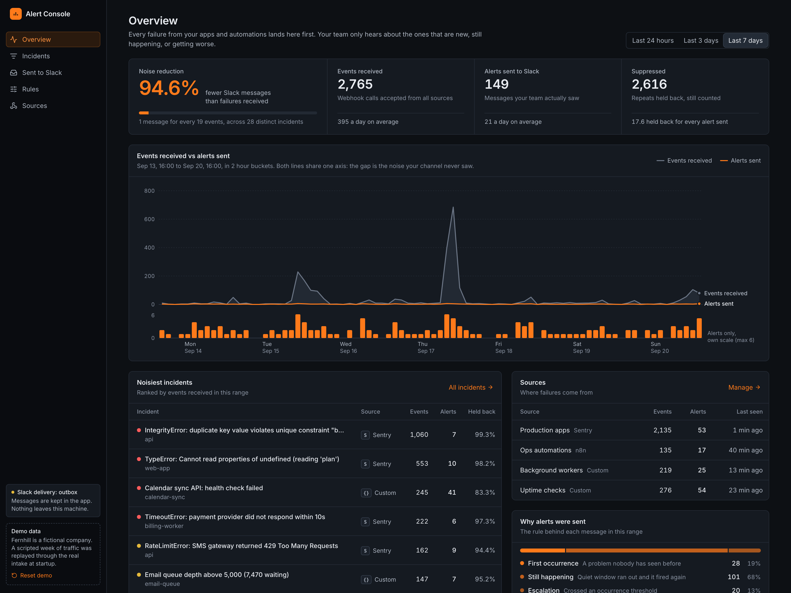
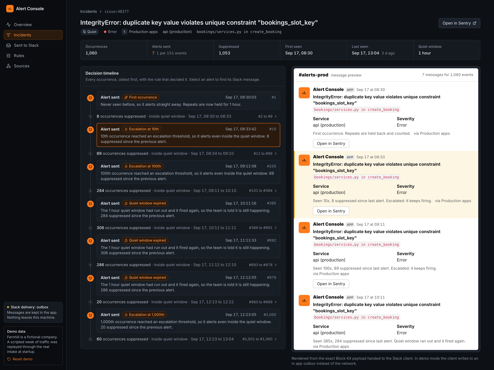
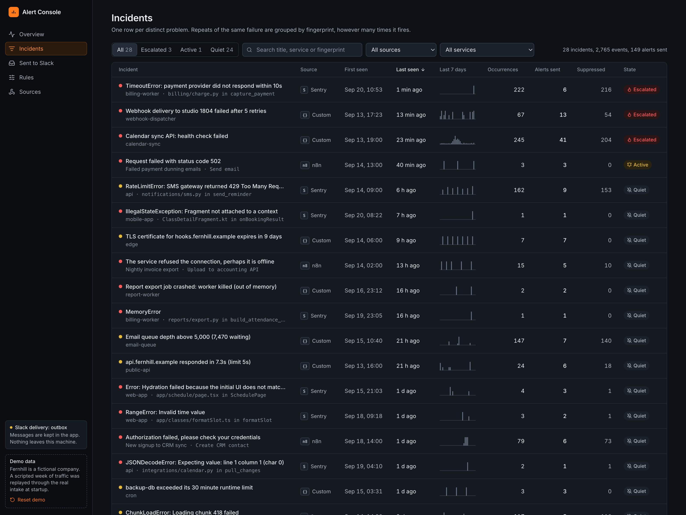
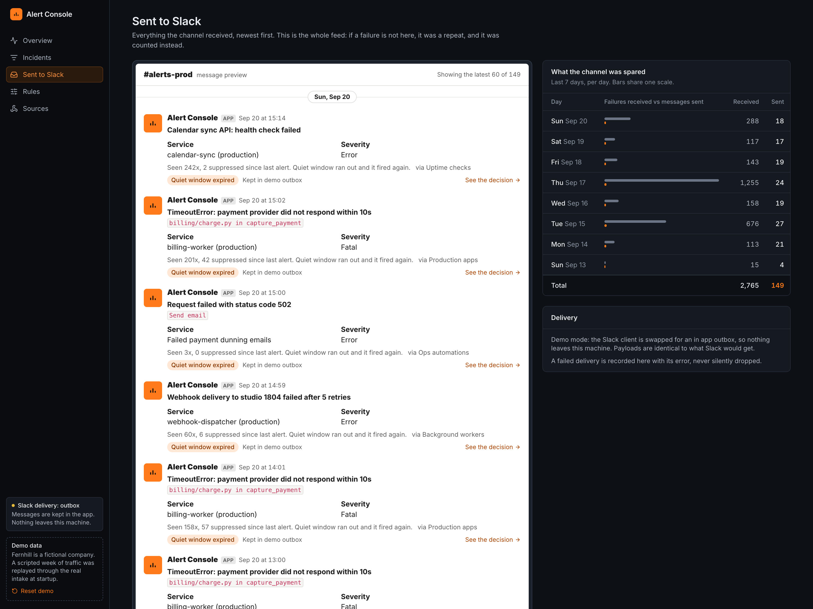
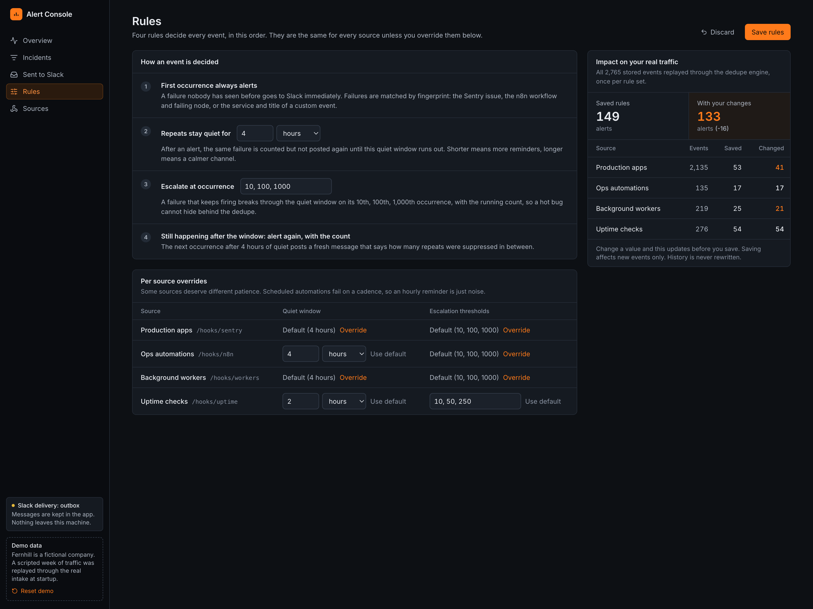
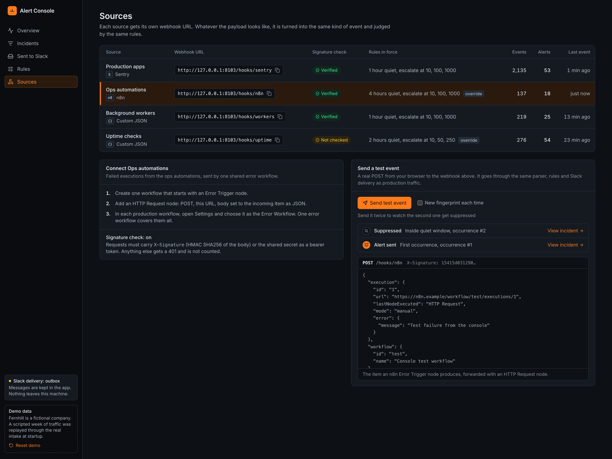

# Alert Console

**A failure alert hub for apps and automations: n8n, webhooks and Sentry in, deduplicated Slack alerts out.** Python, FastAPI, SQLite, React, TypeScript, Tailwind. 30 tests. Runs offline with one command, or in Docker.

When an app or an automation fails, teams either hear nothing (the workflow died silently) or hear far too much (one bug posts 400 Slack messages until everyone mutes the channel). Alert Console sits between your failure sources and Slack and makes sure every distinct problem is announced once, escalated if it keeps firing, and never lost.



In the bundled demo week, 2,765 failure events from four sources became 149 Slack messages: 94.6% less noise, with every one of the 28 distinct incidents still announced the moment it first appeared. Those numbers are not typed into the UI. They come from replaying a scripted week of traffic through the real intake and dedupe code at startup.

## What it does

- **One inbox for failures.** Sentry issue alerts, n8n error workflows, and any cron job, worker, Zapier or Make scenario that can POST JSON. Each source gets its own webhook URL and an optional signature check.
- **Duplicate prevention.** The first occurrence alerts immediately. Repeats inside a quiet window are counted, not posted.
- **Escalation.** A failure that keeps firing breaks through on its 10th, 100th and 1000th occurrence, with the running count, so a hot bug cannot hide behind the dedupe.
- **"Still happening" reminders.** The next occurrence after the quiet window posts again and says how many repeats were suppressed in between.
- **An audit trail for every decision.** Every event is stored with whether it alerted or was suppressed, and the rule that decided. The incident page shows that timeline next to the exact Slack messages that went out.
- **Rules you can tune safely.** Change the quiet window or thresholds (per source if you like) and see how many alerts your real stored traffic would have produced, before you save.
- **No silent delivery failures.** Slack posts are retried, and a delivery that still fails is recorded with its error.



Screens: Overview (noise reduction over a selectable range, events versus alerts chart, noisiest incidents, sources), Incidents (one row per fingerprint, with filters), Incident detail (decision timeline beside the Slack messages), Sent to Slack (the full channel feed), Rules, and Sources (webhook URLs, signature status, a "Send test event" button that really posts to the intake).

## Screens

| | |
|---|---|
|  |  |
| One row per distinct failure, with source, counts, state and working filters. | The channel feed, exactly as the messages were delivered. |
|  |  |
| Change the quiet window or thresholds and preview the effect on stored traffic before saving. | Each source with its webhook URL, signature check and a working test event button. |

## Run the demo

Needs Python 3.11+ and Node 20+. No API keys, no network.

```bash
make demo        # creates .venv, builds the web console, serves everything on http://localhost:8103
```

One process, one port: FastAPI serves the JSON API, the webhook intake and the built React console. Demo state lives in memory, so a restart (or the "Reset demo" control in the sidebar) replays the identical week. The demo clock starts at the most recent 15:40 local time so the replay produces the same numbers on every start.

```bash
make test        # 30 tests, no network (httpx MockTransport, in memory SQLite)
make dev-api     # API on :8103, pair with: make dev-web (Vite with hot reload and a proxy)
docker compose up --build    # same demo in a container on http://localhost:8103
```

## Run it for real

```bash
pip install -e .
cd web && npm install && npm run build && cd ..
SLACK_WEBHOOK_URL=https://hooks.slack.com/... python -m sentry_slack.app
```

Then point each source at its URL:

| source | URL | how |
|---|---|---|
| Sentry | `https://your-host/hooks/sentry` (the original `/sentry` still works) | Settings, Integrations, Webhooks, then an alert rule that sends to the webhook |
| n8n | `https://your-host/hooks/n8n` | one workflow with an Error Trigger node and an HTTP Request node that POSTs the item, selected as the Error Workflow in your production workflows |
| anything else | `https://your-host/hooks/custom` | `curl -X POST -H 'content-type: application/json' -d '{"title":"backup-db failed","service":"cron","severity":"error"}' https://your-host/hooks/custom` |

Custom payload fields: `title` (required), `service`, `severity` (`fatal`, `error`, `warning`, `info`), `fingerprint` (optional, to control grouping yourself), `details` (string or object), `url`, `environment`.

The console has no login of its own. Put it behind your VPN, an auth proxy, or a private network; only the `/hooks/*` paths need to be reachable by the senders.

### Env

| var | default | |
|---|---|---|
| `DEMO_MODE` | unset | `1` runs the offline demo: in memory state, replayed week, Slack messages go to an in app outbox |
| `SLACK_WEBHOOK_URL` | required unless demo | Slack incoming webhook |
| `SENTRY_CLIENT_SECRET` | unset | if set, Sentry requests need a valid `Sentry-Hook-Signature` |
| `HOOK_SECRET_<ID>` | unset | secret for source `<ID>`, for example `HOOK_SECRET_N8N`. Accepts an `X-Signature` HMAC SHA256 of the body, or `Authorization: Bearer <secret>` for senders that cannot sign |
| `SOURCES` | `sentry:sentry,n8n:n8n,custom:generic` | `id:kind` pairs, to add more webhook URLs (kinds: `sentry`, `n8n`, `generic`) |
| `DEDUPE_WINDOW_SECONDS` | 3600 | initial quiet window (editable later on the Rules screen) |
| `STATE_DB` | state.db | SQLite path; mount it if you want state across container restarts |
| `SLACK_CHANNEL_LABEL` | #alerts | display only; the webhook decides the real channel |
| `PORT` | 8080 | |

## Engineering notes

```
Sentry webhook   \
n8n error item    >  /hooks/{source}  ->  parser  ->  fingerprint  ->  dedupe (SQLite)  ->  Slack client (or demo outbox)
custom JSON      /                                                        |
                                                                          v
                                                      events + decisions + deliveries (SQLite)  ->  /api  ->  web console
```

### Rules

| situation | what happens |
|---|---|
| first time a fingerprint is seen | one Slack message |
| same fingerprint again inside the quiet window (default 1h) | silent, counted |
| 10th, 100th, 1000th occurrence | message anyway, with the count ("seen 100x, 89 suppressed") |
| window expires and it fires again | message, with how many were suppressed |
| restart of the bridge | nothing re-alerts; state is in SQLite |

Every source goes through the same `Deduper.decide`. The quiet window and thresholds can be overridden per source; the override is passed into `decide` per call, so there is still exactly one implementation of the rules.

### Fingerprints

- Sentry: the issue id when present, otherwise a hash of project + title + culprit, so unknown payload shapes still dedupe instead of crashing.
- n8n: workflow id + failing node + error message.
- Custom: the `fingerprint` you send, otherwise service + title.

For n8n and custom events, numbers, hex ids and UUIDs are stripped before hashing, so "order 1841 failed" and "order 1977 failed" are one incident, not two.

### Honest demo data

`sentry_slack/demo.py` never writes to the database. It builds raw payloads in each source's native shape (hot path bugs that fire hundreds of times, one off errors, n8n workflows failing on a schedule, a flapping integration, for a fictional company called Fernhill) and hands them to the same `AlertHub.ingest` the HTTP routes call, with injected timestamps (`Deduper.decide` already accepted `now`). Parsers, fingerprints, rules, Slack formatting and the outbox all run for real, and a test asserts that every total on screen reconciles with the persisted events.

The rules preview works the same way: it replays the stored events through a scratch in memory `Deduper`, once with the saved rules and once with the proposed ones. History is never rewritten.

### Layout

```
sentry_slack/
  dedupe.py    the rules, testable without Sentry or Slack
  events.py    the normalized Event every source is turned into
  sentry.py    Sentry payload parsing + fingerprint
  parsers.py   n8n and generic JSON parsers, parser registry
  slack.py     Block Kit message format, Slack client with retries, demo outbox client
  store.py     SQLite history: events, decisions, deliveries, settings
  hub.py       the shared pipeline (parse, decide, record, deliver) and the read models
  api.py       JSON API under /api
  demo.py      the scripted week, replayed through the real intake
  app.py       FastAPI wiring, signature checks, static console
web/           React 19 + TypeScript + Vite + Tailwind v4 console (charts are hand written SVG)
tests/         dedupe rules, parsers, persisted decisions, stats and the rest of the API
```

MIT.
